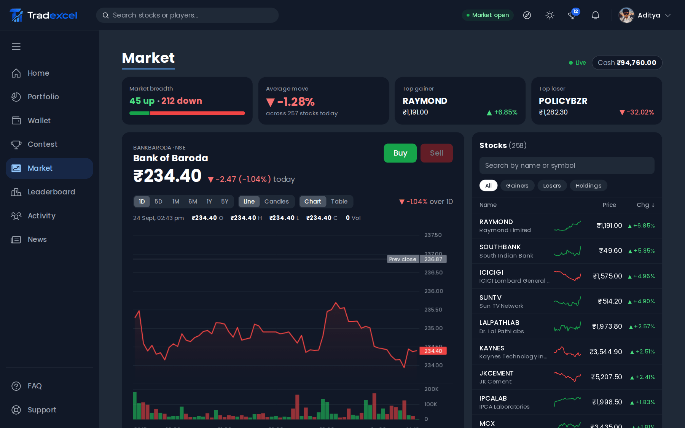
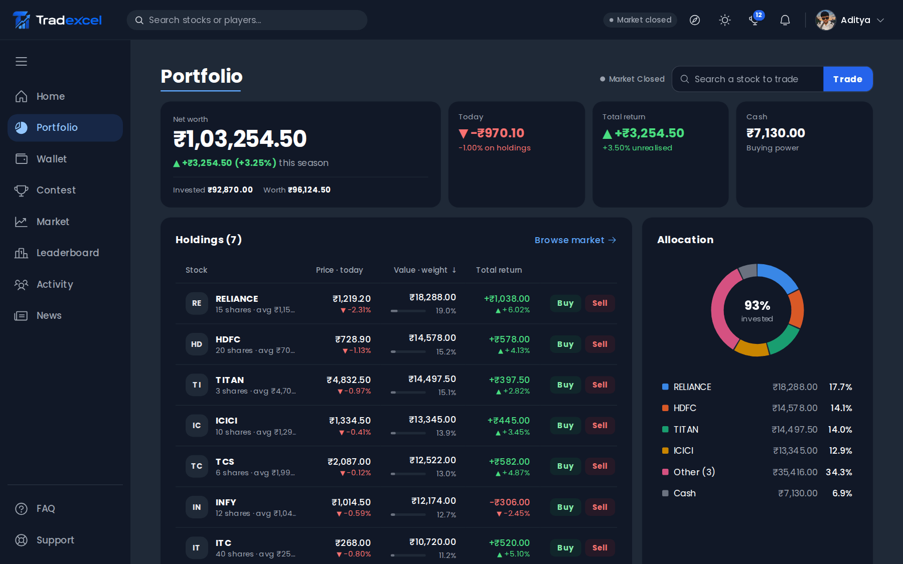
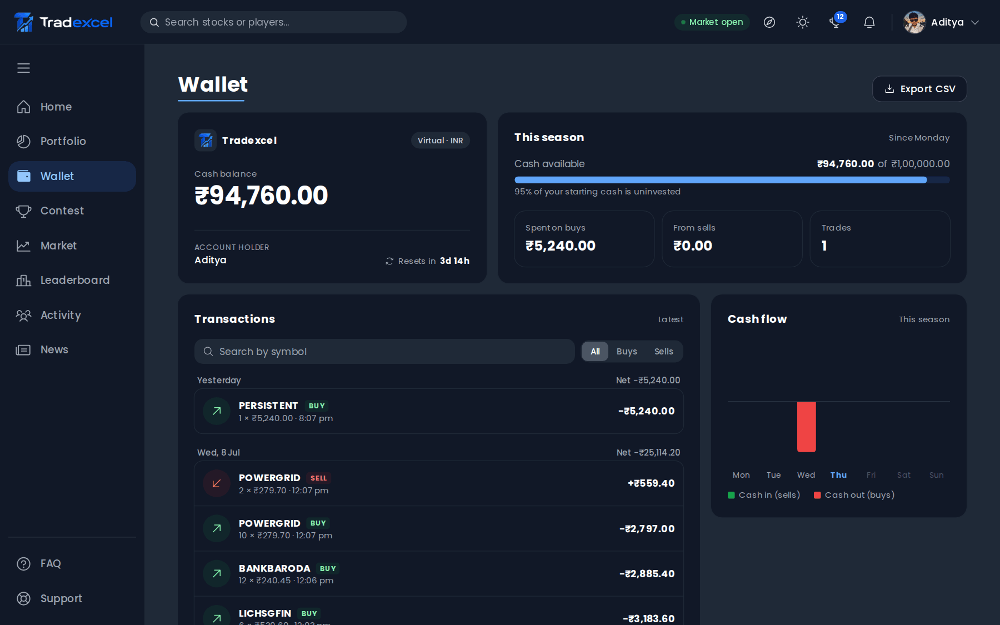
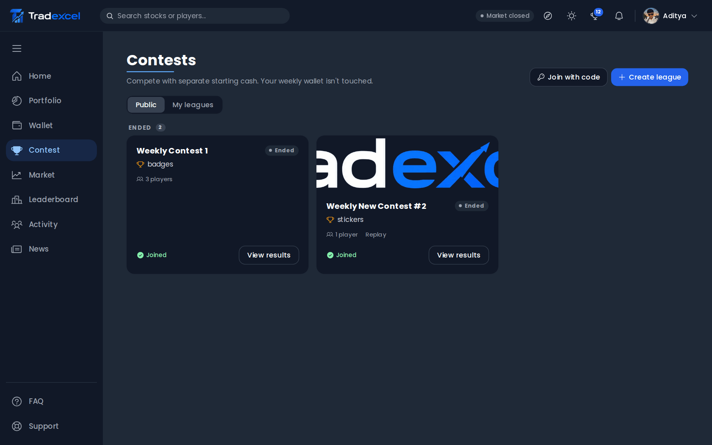
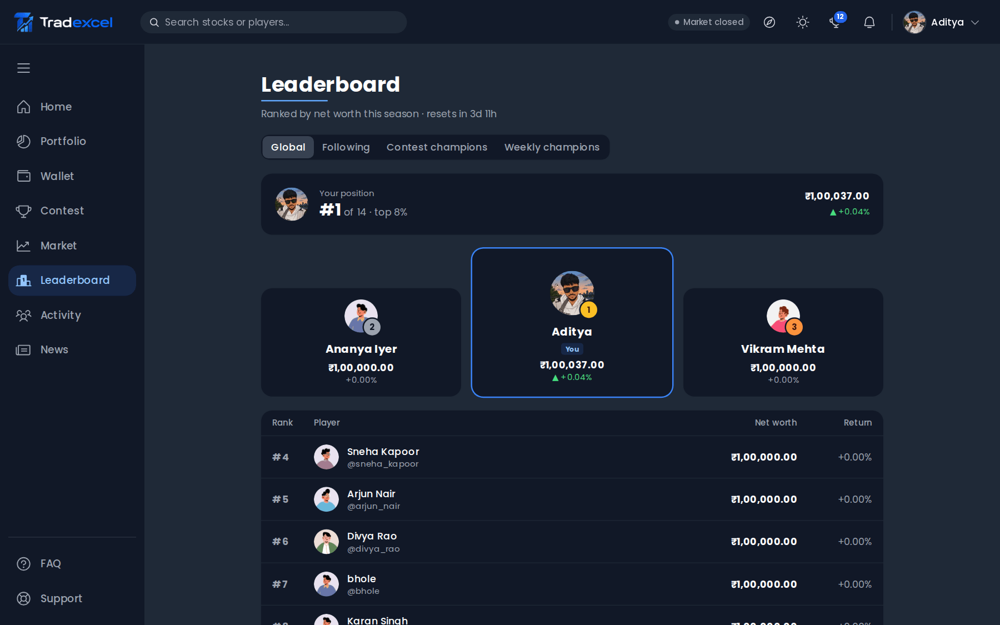
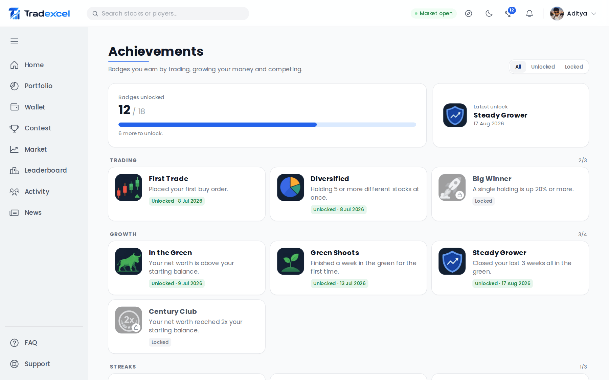
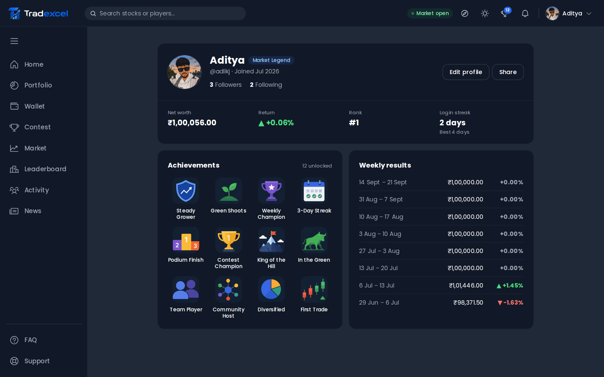
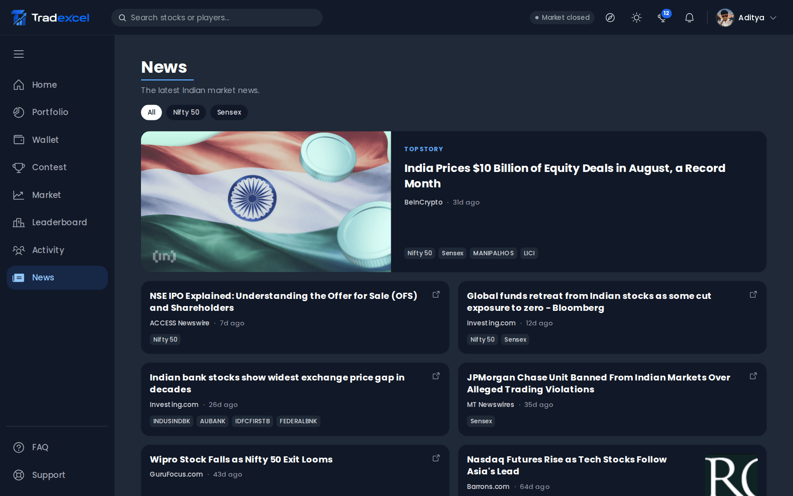
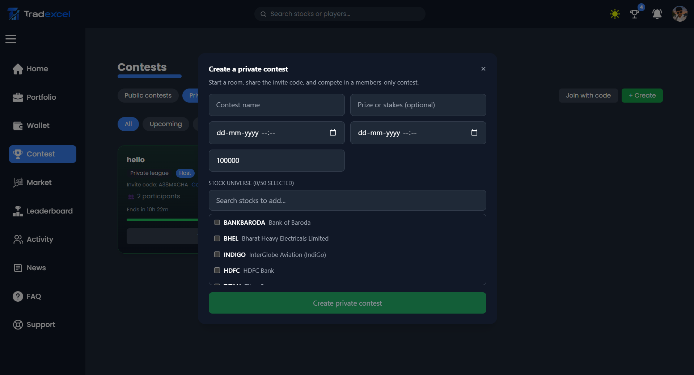

<p align="center">
  
</p>

<p align="center">
  A gamified stock market simulator. Trade real, live-priced NSE stocks with virtual money, compete in contests, climb the leaderboard, and ask Tex, the built-in assistant, when you get stuck.
</p>

<p align="center">
  <a href="https://tradexcel.app">Live site</a> ·
  <a href="https://huggingface.co/adiikj/tradexcel-assistant-encoder">Assistant model on Hugging Face</a> ·
  <a href="ml/README.md">ML pipeline</a>
</p>



## Contents

- [What it is](#what-it-is)
- [Features](#features)
- [Screenshots](#screenshots)
- [Tex, the in-app assistant](#tex-the-in-app-assistant)
- [Tech stack](#tech-stack)
- [Repository layout](#repository-layout)
- [Getting started](#getting-started)
- [Environment variables](#environment-variables)
- [Scripts](#scripts)
- [Testing](#testing)
- [Architecture notes](#architecture-notes)
- [API overview](#api-overview)
- [Deployment](#deployment)

## What it is

Tradexcel lets anyone learn how the stock market works without risking a rupee. Every new player gets **₹1,00,000 in virtual cash** and can buy and sell any of about 258 NSE listed stocks at real market prices. Prices stream in live while the market is open, and everything else (portfolio, net worth, rankings) updates around them.

No real money ever moves. There are no payments, deposits or withdrawals, and balances reset every week so everyone competes on a level field.

This is a portfolio project. It aims to show a correct trading engine, a clean full-stack architecture and a small but honest ML system, not to make money.

## Features

**Trading**
- Buy and sell at live prices from Yahoo Finance, with market-hours awareness (NSE, Mon to Fri, 9:15 AM to 3:30 PM IST).
- Queued orders: orders placed while the market is closed execute when it opens.
- Holdings track weighted-average buy price. All money math uses `Prisma.Decimal`, never floats, and every trade runs in a single database transaction with ledger check constraints.
- Line and candlestick charts (1D to 5Y), market breadth, top gainers and losers, and a table view.

**Live data**
- Socket.IO price feed. One central 5 second broadcast loop fetches quotes once for every symbol anyone is watching and only emits real changes.
- A `marketStatus` event, so the UI shows "Market closed" with the next open time instead of a fake "Live" badge.

**Competition**
- **Weekly seasons:** every Monday 00:00 UTC each player's week is snapshotted, holdings are liquidated and the wallet resets to ₹1,00,000.
- **Leaderboards:** global, friends only, contest champions and weekly champions.
- **Contests:** public contests created by admins, and private invite-code leagues any player can host. Each contest has its own isolated wallet and ledger, and can optionally replay a historical date range.
- **18 achievement badges** for trading, streaks, contests, weekly performance and social milestones.

**Social**
- Follow other traders, see their trades in an activity feed, and share public profiles that work for logged-out visitors.
- Global search for stocks and players from the header.
- Notification bell for new followers and unlocked badges.

**Everything else**
- Price alerts (above or below a target) that email you when triggered.
- Market news feed.
- Email + password or PIN sign-in, email OTP verification, Google OAuth and password reset.
- Light and dark themes.
- A separate admin panel for managing public contests.

## Screenshots

| Portfolio | Wallet |
|---|---|
|  |  |

| Contests | Leaderboard |
|---|---|
|  |  |

| Achievements | Profile |
|---|---|
|  |  |

| News | Private league setup |
|---|---|
|  |  |

## Tex, the in-app assistant

Tex is a chat widget on every signed-in page. It answers questions about the platform ("how do contests work?"), teaches trading basics ("what is a stop loss?") and looks up your own data ("what's my rank?", "how is my portfolio doing?", "price of Infosys").

It does **not** use a hosted LLM. Instead:

1. **Guard rules** (regex) catch requests for investment advice first. Tex never tells anyone what to buy or sell, and refusals are fixed cards, never generated text.
2. A **fine-tuned MiniLM-L6 sentence encoder** (22M parameters) embeds the message once.
3. A **logistic-regression intent head** on that embedding picks one of 13 intents: answer from a card, one of the live-data lookups (price, holding, portfolio, rank, achievements, contests, alerts, orders), refusal or out of scope.
4. For card intents, **dense retrieval** over 142 hand-written knowledge-base cards finds the answer. Below a confidence threshold Tex asks "did you mean...?" instead of guessing.
5. A **stock-name linker** resolves company names and aliases to NSE symbols for live lookups.

The model is trained in Python (`ml/`), exported to ONNX and served inside the Express backend with transformers.js. It adds about 9 ms per message and fits on a 1 GB VM.

Results on a separately written, style-shifted held-out set (typos, slang, rambling, adversarial phrasing):

| | pretrained MiniLM | fine-tuned MiniLM |
|---|---:|---:|
| Intent macro-F1 | 73.8 | **76.5** |
| Router: correct answers | 53.2% | **63.9%** |
| Router: correct or useful "did you mean" | 72.9% | **80.6%** |
| Advice-refusal recall | 85.0% | **95.0%** |

Full baselines (BM25, TF-IDF, off-the-shelf embeddings), learning curves, confusion matrices, the ONNX export report and known limitations are in [ml/README.md](ml/README.md) and the [model card](ml/MODEL_CARD.md).


## Tech stack

| Area | Tools |
|---|---|
| Frontend | Next.js 16 (App Router), React 18, TypeScript, Redux Toolkit, Tailwind CSS, Framer Motion, Chart.js, lightweight-charts, Socket.IO client |
| Backend | Node 20+, Express, TypeScript, Prisma, PostgreSQL, Socket.IO, node-cron, Zod, Pino, Helmet, express-rate-limit |
| Services | Yahoo Finance (prices, history, news), Resend (email), Cloudinary (avatars and contest images), Google OAuth |
| ML | Python, PyTorch, sentence-transformers, scikit-learn, ONNX, transformers.js |
| Testing | Vitest, Testing Library, Playwright, pytest |
| Tooling | pnpm workspaces |

## Repository layout

```
Tradexcel/
├── apps/
│   ├── frontend/           Next.js app (pages in src/app, UI in src/components)
│   └── backend/
│       ├── prisma/         schema and migrations
│       ├── chat/kb/        assistant knowledge base (YAML cards, intents, stock aliases, eval sets)
│       └── src/
│           ├── controllers/, routes/, middlewares/
│           ├── services/   trading math, pricing, contests, achievements, weekly reset
│           ├── jobs/       cron jobs (settlement, alerts, weekly reset, queued orders)
│           ├── realtime/   Socket.IO price feed
│           └── chat/       assistant runtime (encoder, router, handlers, linker)
├── packages/
│   └── shared/             types and stock list shared by both apps
└── ml/                     training, evaluation, ONNX export and reports for the assistant
```

## Getting started

### Prerequisites

- Node.js 20 or newer
- pnpm 10 (`corepack enable` will pick up the pinned version)
- A PostgreSQL database (local, or a free [Neon](https://neon.tech) project)
- Optional: Resend, Cloudinary and Google OAuth credentials for email, uploads and Google sign-in
- Optional: Python 3.12 if you want to retrain the assistant

### 1. Install

```bash
git clone https://github.com/adiikj/Tradexcel.git
cd Tradexcel
pnpm install
```

`pnpm install` also runs `prisma generate` for the backend.

### 2. Configure

```bash
cp apps/backend/.env.example apps/backend/.env
cp apps/frontend/.env.example apps/frontend/.env.local
```

Fill in the values described in [Environment variables](#environment-variables). At minimum you need `DATABASE_URL`, the token secrets and the frontend API URLs.

### 3. Set up the database

```bash
pnpm --filter @tradexcel/backend db:migrate
pnpm --filter @tradexcel/backend seed:demo     # optional: demo players so leaderboards aren't empty
```

### 4. Run

```bash
pnpm dev          # frontend and backend together
# or separately
pnpm dev:api      # backend on PORT (default 8000)
pnpm dev:web      # frontend on http://localhost:3000
```

On first boot the backend downloads the assistant model from Hugging Face (about 90 MB) and caches it. Set `CHAT_ENABLED=false` to skip this.

## Environment variables

### Backend (`apps/backend/.env`)

| Variable | Required | Description |
|---|---|---|
| `PORT` | no | API port, default `8000` |
| `DATABASE_URL` | yes | PostgreSQL connection string |
| `CORS_ORIGIN` | yes | Frontend origin, e.g. `http://localhost:3000` |
| `ACCESS_TOKEN_SECRET`, `REFRESH_TOKEN_SECRET` | yes | JWT signing secrets |
| `ACCESS_TOKEN_EXPIRY`, `REFRESH_TOKEN_EXPIRY` | yes | e.g. `15m`, `7d` |
| `NODE_ENV` | no | `development` or `production` |
| `GOOGLE_CLIENT_ID` | for Google sign-in | OAuth client ID |
| `RESEND_API_KEY`, `RESEND_FROM_EMAIL` | for email | OTPs, password reset and price alerts |
| `CLOUDINARY_NAME`, `CLOUDINARY_API_KEY`, `CLOUDINARY_API_SECRET` | for uploads | Avatars and contest images |
| `ADMIN_PASSWORD`, `ADMIN_TOKEN_SECRET`, `ADMIN_TOKEN_EXPIRY` | for admin | Admin panel login |
| `CHAT_ENABLED` | no | `true` by default, `false` disables Tex |
| `CHAT_MODEL_ID`, `CHAT_MODEL_REVISION` | no | Hugging Face model and pinned revision |
| `CHAT_CACHE_DIR` | no | Where the model and card index are cached |

### Frontend (`apps/frontend/.env.local`)

| Variable | Example (local) |
|---|---|
| `NEXT_PUBLIC_API_BASE_URL` | `http://localhost:8000/api/v1/users` |
| `NEXT_PUBLIC_API_FINANCE_URL` | `http://localhost:8000/api/v1/finance` |
| `NEXT_PUBLIC_API_TRADE_URL` | `http://localhost:8000/api/v1` |
| `NEXT_PUBLIC_SOCKET_URL` | `http://localhost:8000` |
| `NEXT_PUBLIC_GOOGLE_CLIENT_ID` | same client ID as the backend |
| `NEXT_PUBLIC_SITE_URL` | `http://localhost:3000` |

## Scripts

From the repo root:

| Command | What it does |
|---|---|
| `pnpm dev` | Run every app in watch mode |
| `pnpm dev:web` / `pnpm dev:api` | Run only the frontend or backend |
| `pnpm build` | Build all packages |
| `pnpm lint` | Lint all packages |

Backend (`pnpm --filter @tradexcel/backend <script>`):

| Script | What it does |
|---|---|
| `test` | Unit tests (Vitest) |
| `db:migrate` / `db:deploy` / `db:studio` | Prisma migrate (dev), deploy, and Studio |
| `seed:demo` | Create demo players |
| `backfill:wallets` | Create wallets for users missing one |
| `chat:validate` | Validate the knowledge base and check no test question leaks into training |
| `chat:export` | Export the knowledge base to `ml/data/kb_export.json` |
| `chat:eval` | Evaluate the live assistant runtime on the held-out set |

Frontend (`pnpm --filter @tradexcel/frontend <script>`): `dev`, `build`, `start`, `lint`, `test`, `typecheck`.

ML commands (training, baselines, evaluation, ONNX export) are documented in [ml/README.md](ml/README.md).

## Testing

```bash
pnpm --filter @tradexcel/backend test     # trade math, queued orders, charts, contest clock, chat runtime, KB
pnpm --filter @tradexcel/frontend test    # auth session, HTTP client, theme, chat widget
cd ml && .venv/bin/python -m pytest       # data splits, metrics, linker, router, guard rules
```

The backend chat tests include a parity fixture that checks the Node runtime produces the same embeddings and routing decisions as the Python pipeline.

## Architecture notes

- **Ledger correctness.** Buys and sells lock the user's ledger, validate funds or quantity, write the holding and an immutable transaction row, and update the wallet inside one Prisma `$transaction`. Database check constraints reject negative balances or quantities even if application code is wrong.
- **Contest isolation.** Contest trading uses its own `ContestEntry`, `ContestHolding` and `ContestTransaction` tables, so it never touches a player's main wallet.
- **Background jobs** run in-process with node-cron:

  | Job | Schedule |
  |---|---|
  | Contest settlement (final ranks, badges) | every minute |
  | Queued order execution | every minute |
  | Price alert checker (skipped when the market is closed) | every 2 minutes |
  | Weekly reset | Monday 00:00 UTC |

  Settlement, alerts and the weekly reset also run once at startup, so nothing is missed across restarts.
- **Price caching.** Quotes are cached for 12 seconds while the market is open and 30 minutes when it's closed, which keeps Yahoo Finance traffic low.
- **Security.** Helmet headers, CORS locked to the frontend origin, JWT access and refresh tokens in httpOnly cookies, tiered rate limits (global, auth, public, mutation, trade and chat) and a separate credential path for admins.
- **Shared types.** `packages/shared` holds the wire types and stock universe used by both apps.

## API overview

All REST routes live under `/api/v1`.

| Area | Routes |
|---|---|
| Auth and users | `/users/*`: register, login, Google login, OTP, refresh, profile, avatar, password and PIN |
| Market data | `/finance/stock/:symbol`, `/finance/quotes?symbols=...` |
| Trading | `/trade/buy`, `/trade/sell`, `/wallet`, `/portfolio`, `/transactions` |
| Leaderboards | `/leaderboard`, `/leaderboard/friends`, `/hall-of-fame` |
| Contests | `/contests`, `/contests/:id`, `/contests/:id/join`, `/contests/:id/standings`, `/contests/:id/trade/buy\|sell`, `/contests/private`, `/contests/private/join` |
| Social | `/social/search`, `/social/activity`, `/users/:username/profile`, `/users/:username/follow`, followers and following |
| Other | `/alerts`, `/notifications`, `/achievements`, `/news`, `/chat` |
| Admin | `/admin/login`, `/admin/contests/*` |

WebSocket (Socket.IO on the same host): `subscribe`, `unsubscribe`, `price`, `marketStatus`.

A fuller, machine-readable map of the product lives in [apps/frontend/public/llms.txt](apps/frontend/public/llms.txt).

## Deployment

- **Frontend:** Vercel.
- **Backend:** an always-on Azure VM (2 burstable vCPUs, 1 GB RAM). A long-running host was chosen over serverless because of the persistent WebSocket connections and cron jobs.
- **Database:** PostgreSQL on Neon.

When deploying new backend code, apply migrations before starting it:

```bash
pnpm --filter @tradexcel/backend db:deploy
pnpm --filter @tradexcel/backend build
pnpm --filter @tradexcel/backend start
```

---

Built by [Aditya Kumar Jha](https://github.com/adiikj). Tradexcel is a learning simulator. Nothing on the platform or from Tex is financial advice.
