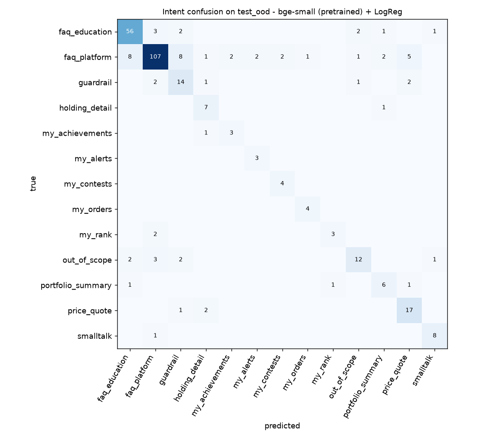

# Baselines (P2)

Knowledge base `67f79e0101fd4658`, seed 13. Generated by `python -m tradexcel_ml.baselines` - do not edit by hand.

Everything below uses **off-the-shelf** components (at most a linear head is trained). These are the numbers the fine-tuned models in P3 must beat.

**Splits.** Card questions are split 70/15/15 per card; the retriever only indexes card titles + *train* questions. Intent templates are split by template before being filled with stock names, so test sentences come from unseen templates. `test_ood` is the hand-written held-out set in deliberately different styles. Models are selected on `val` only.

| split | examples | with a card target |
|---|---:|---:|
| train | 1217 | 880 |
| val | 237 | 156 |
| test | 237 | 156 |
| test_ood | 310 | 233 |

## Retrieval (which card answers the question)

| retriever | val R@1 | test R@1 | test R@3 | test MRR | **OOD R@1** | OOD R@3 | OOD MRR |
|---|---:|---:|---:|---:|---:|---:|---:|
| BM25 | 37.2 | 42.9 | 62.2 | 0.548 | **65.7** | 78.5 | 0.744 |
| TF-IDF (char 3-5) | 39.7 | 42.9 | 62.2 | 0.561 | **60.9** | 81.1 | 0.726 |
| MiniLM-L6 (pretrained) ✅ | 62.2 | 63.5 | 82.7 | 0.739 | **77.3** | 91.4 | 0.847 |
| Hybrid RRF (BM25 + MiniLM-L6 (pretrained)) | 48.7 | 57.1 | 72.4 | 0.675 | **74.2** | 89.3 | 0.819 |
| bge-small (pretrained) | 55.8 | 68.6 | 84.0 | 0.773 | **79.4** | 93.6 | 0.866 |
| Hybrid RRF (BM25 + bge-small (pretrained)) | 50.6 | 56.4 | 75.0 | 0.673 | **75.1** | 88.8 | 0.829 |

OOD R@1 by writing style:

| retriever | adversarial | formal | multi | plain | rambling | slang | terse | typo |
|---|---:|---:|---:|---:|---:|---:|---:|---:|
| BM25 | 30.8 | 60.0 | 0.0 | 60.5 | 40.0 | 88.2 | 74.5 | 66.7 |
| TF-IDF (char 3-5) | 23.1 | 60.0 | 0.0 | 53.1 | 60.0 | 64.7 | 71.3 | 75.0 |
| MiniLM-L6 (pretrained) | 61.5 | 80.0 | 100.0 | 75.3 | 70.0 | 82.4 | 80.9 | 75.0 |
| Hybrid RRF (BM25 + MiniLM-L6 (pretrained)) | 46.2 | 60.0 | 100.0 | 76.5 | 50.0 | 76.5 | 78.7 | 75.0 |
| bge-small (pretrained) | 69.2 | 80.0 | 0.0 | 77.8 | 60.0 | 94.1 | 83.0 | 75.0 |
| Hybrid RRF (BM25 + bge-small (pretrained)) | 46.2 | 60.0 | 0.0 | 74.1 | 60.0 | 88.2 | 80.9 | 75.0 |

## Intent classification

| model | val macro-F1 | test macro-F1 | **OOD macro-F1** | OOD acc | OOD guardrail recall | OOD out-of-scope recall |
|---|---:|---:|---:|---:|---:|---:|
| TF-IDF (word+char) + LogReg | 60.5 | 56.3 | **71.5** | 79.0 | 65.0 | 30.0 |
| MiniLM-L6 (pretrained) + LogReg | 70.1 | 71.6 | **73.8** | 76.8 | 60.0 | 60.0 |
| MiniLM-L6 (pretrained) + kNN (k=5) | 52.6 | 53.7 | **63.4** | 75.2 | 55.0 | 25.0 |
| bge-small (pretrained) + LogReg ✅ | 72.4 | 75.2 | **74.2** | 78.7 | 70.0 | 60.0 |
| bge-small (pretrained) + kNN (k=5) | 60.4 | 57.8 | **72.0** | 81.9 | 50.0 | 20.0 |

Per-intent OOD F1 for the selected model (bge-small (pretrained) + LogReg):

| intent | F1 |
|---|---:|
| guardrail | 59.6 |
| portfolio_summary | 63.2 |
| my_achievements | 66.7 |
| my_rank | 66.7 |
| out_of_scope | 66.7 |
| holding_detail | 70.0 |
| my_alerts | 75.0 |
| price_quote | 75.6 |
| my_contests | 80.0 |
| faq_platform | 83.3 |
| smalltalk | 84.2 |
| faq_education | 84.8 |
| my_orders | 88.9 |

## Stock-name linking (rule-based)

| eval set | cases | exact match | precision | recall | F1 | ambiguity handled |
|---|---:|---:|---:|---:|---:|---:|
| entity test set | 176 | 99.4 | 100.0 | 99.3 | 99.7 | 100.0 |
| held-out price/holding questions | 35 | 100.0 | 100.0 | 100.0 | 100.0 | – |

Linker failures:

| text | expected | got |
|---|---|---|
| wipr0 | WIPRO.NS | ∅ |

## Encode latency (this dev machine, CPU, batch of 1)

| model | p50 ms | p95 ms |
|---|---:|---:|
| MiniLM-L6 (pretrained) | 14.1 | 19.1 |
| bge-small (pretrained) | 21.9 | 28.4 |

## Where the selected retriever fails (test_ood, 53 misses)

| query | style | expected | got |
|---|---|---|---|
| I ran out of cash on Wednesday, is there any way to top up my wallet before the week ends? | rambling | wallet.starting_balance | edu.game_strategy |
| Could you kindly explain what occurs at the conclusion of each weekly season? | formal | season.weekly_reset | edu.game_strategy |
| do shares roll over into the next season | plain | season.weekly_reset | edu.market_session |
| I bought something last Tuesday and want to check the exact price I paid, where would that be? | rambling | wallet.transaction_history | trade.fill_price |
| hw do i purchse stocks here | typo | trade.how_to_buy | guardrail.investment_advice |
| nse timings | terse | trade.market_closed | edu.stock_exchange |
| clicked buy at 500 but got 501.2 | terse | trade.fill_price | trade.quantity_rules |
| i cant find zomato anywhere | plain | market.which_stocks | ui.search |
| can i invest in the nifty index itself | plain | market.which_stocks | edu.index_fund_etf |
| is the data delayed compared to nse | plain | market.live_prices | edu.stock_exchange |
| i want an email when reliance crosses 3000 | plain | alerts.create | unsupported.assistant_trading |
| my alert never fired even though the price went past it on saturday | rambling | alerts.create | alerts.manage |
| can an alert go off again after it has triggered | plain | alerts.manage | alerts.create |
| notifs where | slang | notifications.bell | edu.sector |
| hall of fame | terse | leaderboard.hall_of_fame | leaderboard.ranking |
| what's the title after bull runner | plain | achievements.titles | edu.bull_bear |
| if i join a contest will it use my weekly money | plain | contest.how_it_works | contest.prize |
| why cant i buy tcs in this contest | plain | contest.how_it_works | contest.join_timing |
| creat private leage | typo | contest.private_league | social.privacy |
| how is ranking decided inside a league | plain | contest.standings | leaderboard.ranking |
| contest over, do i get to keep the cash from it | plain | contest.end | unsupported.leave_contest |
| just signed up, what now | terse | about.what_is_tradexcel | account.signup |
| how do i stop following someone | plain | social.follow | social.privacy |
| can i see what the people i follow are buying | plain | social.activity | wallet.transaction_history |
| who can see my portfolio | plain | social.public_profile | portfolio.page |

…and 28 more in `ml/artifacts/baseline_retrieval_misses.json`.

## Caveats

- All data, including the test sets, is synthetic and written by the same author, so absolute numbers are optimistic. `test_ood` narrows that gap by using unseen phrasings and styles; real logged questions will be added as a further test set in P6.
- `test_ood` is small (310 cases), so differences of a couple of points are within noise.
- `test` can score *below* `test_ood`: each card's questions cover different facets of the topic, and the held-out one is often the most canonical ("what is market cap"), which then has to be answered from the card's other facets. `test_ood` questions target a card's main topic. (Sanity check: queries that are in the index score R@1 = 100%, so this isn't a scoring bug.)
- Equal-weight RRF with BM25 can score below the dense model alone: when one retriever is much weaker, fusing ranks mostly adds its mistakes. P3 will tune the fusion weight on `val` instead.
