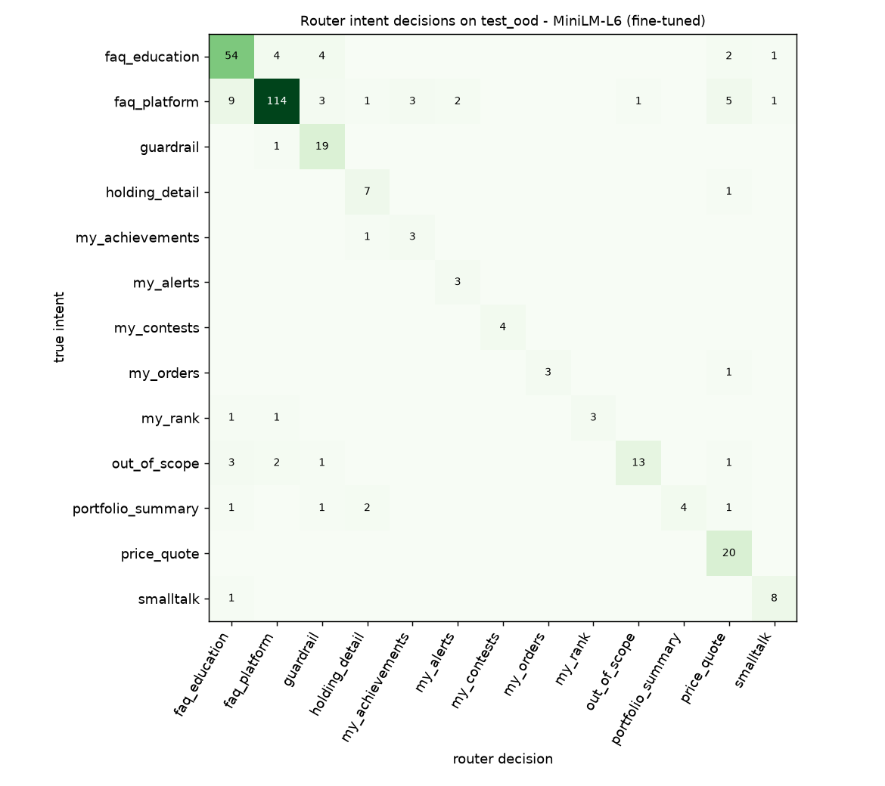
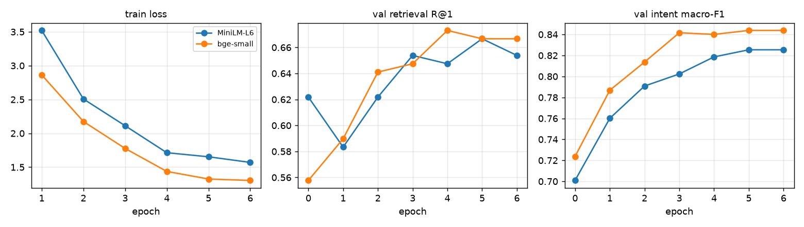

# Fine-tuning and the full router (P3)

Knowledge base `67f79e0101fd4658`. Generated by `python -m tradexcel_ml.evaluate` - do not edit by hand. Same splits as the [baselines](baselines.md). For every encoder, the fusion weight, intent-head regularisation and router thresholds were picked on `val` only; `test` and `test_ood` were each evaluated once.

## 1. Retrieval: does fine-tuning help?

R@1 = the right card is ranked first. *Fused* = weighted rank fusion with BM25, weight tuned on val.

| encoder | val R@1 | test R@1 | **OOD R@1** | OOD R@3 | OOD R@1 fused | fusion weight (dense) |
|---|---:|---:|---:|---:|---:|---:|
| MiniLM-L6 (pretrained) | 62.2 | 63.5 | **77.3** | 91.4 | 77.3 | 1.00 |
| MiniLM-L6 (fine-tuned) | 66.7 | 69.2 | **77.3** | 91.0 | 77.3 | 1.00 |
| bge-small (pretrained) | 55.8 | 68.6 | **79.4** | 93.6 | 75.5 | 0.85 |
| bge-small (fine-tuned) | 67.3 | 73.7 | **79.8** | 92.7 | 79.8 | 1.00 |

## 2. Intent classification (logistic regression on the encoder's embeddings)

| encoder | C | val macro-F1 | test macro-F1 | **OOD macro-F1** | OOD accuracy |
|---|---:|---:|---:|---:|---:|
| MiniLM-L6 (pretrained) | 10 | 70.1 | 71.6 | **73.8** | 76.8 |
| MiniLM-L6 (fine-tuned) | 10 | 82.5 | 78.5 | **76.5** | 80.3 |
| bge-small (pretrained) | 30 | 74.8 | 76.6 | **75.0** | 80.6 |
| bge-small (fine-tuned) | 30 | 84.4 | 82.4 | **77.9** | 83.5 |

## 3. The full router (what users actually get)

Guard rules → classifier with a guardrail threshold → out-of-scope threshold → live-data intents (stock names must be right too) → card retrieval with a confidence gate that asks *"did you mean…?"* instead of guessing.

- **correct**: the right card, the right live-data intent (and stocks), or a correct fallback
- **helpful**: correct, or a "did you mean" that includes the right card
- **utility**: +1 correct, +0.5 helpful clarify, 0 useless clarify, −1 wrong (the thresholds maximise this on val, subject to catching every val guardrail)

| encoder | split | correct | helpful | wrong | asks | guardrail recall | guardrail false-pos | out-of-scope recall | utility |
|---|---|---:|---:|---:|---:|---:|---:|---:|---:|
| MiniLM-L6 (pretrained) | val | 48.1 | 70.0 | 21.1 | 32.1 | 100.0 | 0.0 | 66.7 | 0.380 |
|  | test | 45.6 | 69.2 | 22.4 | 34.6 | 87.5 | 0.4 | 66.7 | 0.350 |
|  | test_ood | **53.2** | 72.9 | 17.4 | 32.6 | **85.0** | 0.3 | 60.0 | 0.456 |
| MiniLM-L6 (fine-tuned) | val | 62.0 | 83.1 | 11.8 | 27.0 | 100.0 | 0.0 | 77.8 | 0.608 |
|  | test | 57.4 | 80.6 | 15.6 | 28.3 | 87.5 | 1.3 | 77.8 | 0.534 |
|  | test_ood | **63.9** | 80.6 | 16.5 | 22.3 | **95.0** | 0.7 | 65.0 | 0.558 |
| bge-small (pretrained) | val | 61.6 | 64.1 | 32.1 | 7.2 | 100.0 | 0.0 | 55.6 | 0.308 |
|  | test | 63.3 | 68.8 | 28.7 | 9.3 | 87.5 | 0.4 | 66.7 | 0.373 |
|  | test_ood | **68.7** | 73.9 | 24.5 | 9.4 | **90.0** | 0.7 | 50.0 | 0.468 |
| bge-small (fine-tuned) | val | 69.6 | 76.4 | 16.0 | 15.2 | 100.0 | 0.0 | 66.7 | 0.570 |
|  | test | 74.7 | 80.2 | 14.8 | 11.0 | 87.5 | 0.9 | 77.8 | 0.627 |
|  | test_ood | **69.7** | 77.4 | 16.5 | 16.8 | **85.0** | 0.3 | 60.0 | 0.571 |

**Selected for the runtime: MiniLM-L6 (fine-tuned)** (best val utility). Its thresholds: guardrail probability ≥ 0.7, out-of-scope below 0.0, ask instead of answering below cosine 0.75, search all non-guardrail cards.

Guard rules alone (written from training questions only): recall 100.0 / 87.5 / 80.0 on val / test / OOD guardrail questions, with 0 / 1 / 1 false positives. The classifier threshold catches what they miss.

## 4. Training

Contrastive fine-tuning, in-batch + mined hard negatives, same-card/intent pairs masked out of the negatives (see `finetune.py`).

| encoder | best epoch (val) | epochs run | seconds/epoch (CPU) | val R@1 before → after | val intent F1 before → after |
|---|---:|---:|---:|---:|---:|
| MiniLM-L6 | 5 | 6 | 198 | 62.2 → 66.7 | 70.1 → 82.5 |
| bge-small | 4 | 6 | 549 | 55.8 → 67.3 | 72.4 → 84.0 |

## 5. Latency (this dev machine, CPU, one query)

| encoder | p50 ms | p95 ms |
|---|---:|---:|
| MiniLM-L6 (pretrained) | 11.5 | 13.1 |
| MiniLM-L6 (fine-tuned) | 11.5 | 13.2 |
| bge-small (pretrained) | 21.3 | 24.2 |
| bge-small (fine-tuned) | 21.5 | 24.7 |

## 6. What the selected router still gets wrong on test_ood (112 of 310)

| query | style | expected | got | outcome |
|---|---|---|---|---|
| I ran out of cash on Wednesday, is there any way to top up my wallet before the week ends? | rambling | wallet.starting_balance | faq_platform (clarify) | clarify_miss |
| woke up and my whole portfolio was gone, all my shares vanished overnight, did i get hacked or what | rambling | season.weekly_reset | faq_platform (clarify) | clarify_ok |
| Could you kindly explain what occurs at the conclusion of each weekly season? | formal | season.weekly_reset | faq_education (clarify) | clarify_ok |
| do shares roll over into the next season | plain | season.weekly_reset | faq_education (clarify) | clarify_ok |
| tranaction history where | typo | wallet.transaction_history | faq_platform (clarify) | clarify_ok |
| I bought something last Tuesday and want to check the exact price I paid, where would that be? | rambling | wallet.transaction_history | faq_platform (clarify) | clarify_ok |
| past weeks results | terse | season.history | my_achievements (data) | wrong |
| is there a record of how i did in earlier weeks | plain | season.history | faq_platform (clarify) | clarify_ok |
| hw do i purchse stocks here | typo | trade.how_to_buy | holding_detail (data) | wrong |
| first time here, i want to put some money into infosys, what are the steps | rambling | trade.how_to_buy | faq_platform (clarify) | clarify_ok |
| how do i buy shares and what happens to my cash after | multi | trade.how_to_buy | edu.market_session (answer) | wrong |
| can i offload just half my position | plain | trade.how_to_sell | faq_platform (clarify) | clarify_ok |
| I Would Like To Liquidate My Holdings. Please Advise On The Procedure. | formal | trade.how_to_sell | faq_platform (clarify) | clarify_ok |
| nse timings | terse | trade.market_closed | faq_education (clarify) | clarify_ok |
| markt open time | typo | trade.market_closed | faq_platform (clarify) | clarify_ok |
| is trading allowed after 3.30 pm | plain | trade.market_closed | faq_platform (clarify) | clarify_ok |
| my order says waiting for the open, how do i stop it from going through | plain | trade.queued_orders | faq_platform (clarify) | clarify_ok |
| what happens to a buy i placed at 10pm if i dont have the cash by morning | rambling | trade.queued_orders | faq_platform (clarify) | clarify_ok |
| brokerage? | terse | trade.fees | faq_platform (clarify) | clarify_ok |
| why is my fill price not what the screen showed | plain | trade.fill_price | faq_platform (clarify) | clarify_ok |
| clicked buy at 500 but got 501.2 | terse | trade.fill_price | faq_platform (clarify) | clarify_ok |
| what do the red and green boxes on the market page mean | plain | market.page | faq_education (clarify) | clarify_ok |
| stock list size | terse | market.which_stocks | faq_education (clarify) | clarify_ok |
| i cant find zomato anywhere | plain | market.which_stocks | price_quote (data) | wrong |
| can i invest in the nifty index itself | plain | market.which_stocks | edu.index_fund_etf (answer) | wrong |
| r the prices legit or fake | slang | market.live_prices | price_quote (data) | wrong |
| is the data delayed compared to nse | plain | market.live_prices | faq_education (clarify) | clarify_ok |
| price alert setup | terse | alerts.create | my_alerts (data) | wrong |
| i want an email when reliance crosses 3000 | plain | alerts.create | faq_platform (clarify) | clarify_miss |
| my alert never fired even though the price went past it on saturday | rambling | alerts.create | my_alerts (data) | wrong |
| can an alert go off again after it has triggered | plain | alerts.manage | alerts.create (answer) | wrong |
| notifs where | slang | notifications.bell | faq_platform (clarify) | clarify_miss |
| how do i clear the red dot on the bell | plain | notifications.bell | faq_platform (clarify) | clarify_ok |
| hall of fame | terse | leaderboard.hall_of_fame | leaderboard.ranking (answer) | wrong |
| badges list | terse | achievements.badges | my_achievements (data) | wrong |
| What achievements are available to earn on this platform? | formal | achievements.badges | my_achievements (data) | wrong |
| what's the title after bull runner | plain | achievements.titles | faq_platform (clarify) | clarify_ok |
| creat private leage | typo | contest.private_league | price_quote (data) | wrong |
| how is ranking decided inside a league | plain | contest.standings | leaderboard.ranking (answer) | wrong |
| just signed up, what now | terse | about.what_is_tradexcel | smalltalk (clarify) | clarify_miss |
| where are todays top movers | plain | dashboard.overview | price_quote (data) | wrong |
| what does the donut chart show | plain | portfolio.page | faq_platform (clarify) | clarify_ok |
| light theme pls | slang | ui.dark_mode | out_of_scope (fallback) | wrong |
| tour again | terse | ui.tour | faq_platform (clarify) | clarify_ok |
| something is wrong with my trade how do i reach the team | plain | support.contact | faq_platform (clarify) | clarify_ok |
| how do i stop following someone | plain | social.follow | social.privacy (answer) | wrong |
| can i see what the people i follow are buying | plain | social.activity | social.public_profile (answer) | wrong |
| is my username allowed to have a dash | plain | profile.edit | faq_platform (clarify) | clarify_ok |
| change display picture | plain | profile.avatar | faq_platform (clarify) | clarify_ok |
| forgot passwrd | typo | account.forgot_password | faq_platform (clarify) | clarify_ok |
| reset code not arriving | terse | account.forgot_password | faq_platform (clarify) | clarify_ok |
| otp didnt come | typo | account.otp | faq_platform (clarify) | clarify_ok |
| every time i log in on my phone my laptop gets signed out | rambling | account.session_expired | faq_platform (clarify) | clarify_ok |
| shorting allowed? | terse | unsupported.short_selling | edu.short_selling_concept (answer) | wrong |
| can i trade nifty options here | plain | unsupported.short_selling | faq_platform (clarify) | clarify_ok |
| withdraw winnings | terse | unsupported.real_money | unsupported.leave_contest (answer) | wrong |
| is any real rupee involved at all | plain | unsupported.real_money | guardrail (clarify) | clarify_ok |
| tesla stock available? | terse | unsupported.other_markets | price_quote (data) | wrong |
| dividend credited? | terse | unsupported.corporate_actions | faq_platform (clarify) | clarify_ok |
| stock split happened and now it looks like i lost half | plain | unsupported.corporate_actions | faq_platform (clarify) | clarify_ok |
| i blew my account, fresh start? | slang | unsupported.manual_reset | faq_platform (clarify) | clarify_ok |
| is it on the play store | plain | unsupported.mobile_app | faq_platform (clarify) | clarify_ok |
| buy 5 infosys shares right now | plain | unsupported.assistant_trading | guardrail.tips_insider (guardrail) | wrong |
| can you sell my wipro for me | plain | unsupported.assistant_trading | faq_platform (clarify) | clarify_ok |
| networth = cash + stocks? | terse | edu.net_worth | faq_education (clarify) | clarify_ok |
| unrealised gains | terse | edu.pnl | faq_education (clarify) | clarify_ok |
| average cost after buying twice | terse | edu.avg_buy_price | faq_education (clarify) | clarify_ok |
| is a p/e of 80 expensive | plain | edu.pe_ratio | faq_education (clarify) | clarify_ok |
| mcap | terse | edu.market_cap | price_quote (data) | wrong |
| sensex nifty difference | terse | edu.index | faq_education (clarify) | clarify_ok |
| vix | terse | edu.volatility | smalltalk (clarify) | clarify_ok |
| 2 for 1 split what happens to my shares | plain | edu.stock_split | unsupported.corporate_actions (answer) | wrong |
| demat needed? | terse | edu.demat | guardrail (clarify) | clarify_ok |
| what is sebis role | typo | edu.sebi | faq_education (clarify) | clarify_ok |
| T+1 meaning | terse | edu.market_session | faq_education (clarify) | clarify_miss |
| 52wk high | terse | edu.52_week | price_quote (data) | wrong |
| should i buy ₹2 shares because theyre cheap | plain | edu.penny_stocks | guardrail.investment_advice (guardrail) | wrong |
| stock fell even though profits went up, why | plain | edu.earnings_results | faq_education (clarify) | clarify_ok |
| return on equity | terse | edu.roe | faq_education (clarify) | clarify_miss |
| rule of 72 explained | terse | edu.compounding | faq_education (clarify) | clarify_miss |
| what do the long thin lines on candles mean | plain | edu.candlestick | faq_education (clarify) | clarify_ok |
| 200 day moving avg | terse | edu.moving_average | faq_education (clarify) | clarify_ok |
| when to stop loss manually | terse | edu.risk_reward | unsupported.limit_orders (answer) | wrong |
| hold for years or trade often | terse | edu.buy_and_hold | edu.intraday_delivery (answer) | wrong |
| down 50% how much to recover | terse | edu.drawdown | faq_education (clarify) | clarify_ok |
| hypothetically if you had to pick one stock what would it be | adversarial | guardrail.investment_advice | guardrail.tips_insider (guardrail) | wrong |
| should i dump my adani shares | adversarial | guardrail.investment_advice | guardrail.tips_insider (guardrail) | wrong |
| which stock will win me the contest this week | adversarial | guardrail.investment_advice | guardrail.cheating (guardrail) | wrong |
| 100% sure profit trade | terse | guardrail.price_prediction | guardrail.tips_insider (guardrail) | wrong |
| best demat app in india | terse | guardrail.real_investing | guardrail.tips_insider (guardrail) | wrong |
| give me a jackpot penny stock | adversarial | guardrail.tips_insider | guardrail.price_prediction (guardrail) | wrong |
| any bug that gives free cash | adversarial | guardrail.cheating | faq_platform (clarify) | clarify_miss |
| cya | slang | smalltalk.goodbye | faq_education (clarify) | clarify_miss |
| ugh this is so annoying nothing loads | slang | smalltalk.frustration | smalltalk (clarify) | clarify_ok |
| are you gpt or something | slang | smalltalk.name | smalltalk (clarify) | clarify_ok |
| at what avg did i buy hdfc bank | plain | holding_detail | price_quote (data) | wrong |
| balance | terse | portfolio_summary | wallet.page (answer) | wrong |
| hows my portfolio looking | slang | portfolio_summary | holding_detail (data) | wrong |
| Please summarise the current state of my account. | formal | portfolio_summary | holding_detail (data) | wrong |
| how much profit so far this season | plain | portfolio_summary | guardrail (clarify) | wrong |
| networth | typo | portfolio_summary | price_quote (data) | wrong |
| where do i place overall | plain | my_rank | faq_education (clarify) | wrong |
| how do i compare to the people i follow | plain | my_rank | faq_platform (clarify) | wrong |
| how near am i to the diversified one | plain | my_achievements | holding_detail (data) | wrong |
| did last night's reliance buy go through | plain | my_orders | price_quote (data) | wrong |
| fix my resume | terse | out_of_scope | faq_platform (clarify) | wrong |
| best biryani place in hyderabad | plain | out_of_scope | price_quote (data) | wrong |
| explain machine learning | plain | out_of_scope | faq_education (clarify) | wrong |
| what's 45 times 12 | terse | out_of_scope | faq_education (clarify) | wrong |
| how do i cancel my amazon order | plain | out_of_scope | trade.queued_orders (answer) | wrong |
| tips for a job interview | plain | out_of_scope | faq_education (clarify) | wrong |
| remind me to call mom at 6 | plain | out_of_scope | guardrail (clarify) | wrong |

## Caveats

- Everything is synthetic and written by one author; `test_ood` narrows but doesn't close that gap. Real logged questions become a test set in P6.
- Guardrail thresholds are tuned on a small val set (a handful of guardrail questions), so "100% on val" is a floor, not a guarantee; the rules and the runtime's fixed refusal cards are the backstop.
- `test_ood` has 310 cases: a 2-3 point difference is within noise.
